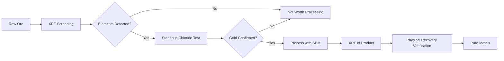

# Analysis Tools

## XRF Analysis

### XRF (X-Ray Fluorescence)
- **Purpose**: Screening tool for elemental analysis
- **Not**: Quantitative assay
- **Best for**: Rapid ore characterization, process monitoring

### Rigaku NEX DE (Recommended)
- Energy dispersive technology
- Detects: PGMs, gold, platinum, rhodium
- 6 months research identified this as sufficient unit
- Very little public documentation available
- Legitimate, verified equipment

### Wavelength Dispersive XRF
- Higher resolution than energy dispersive
- Used for detailed analysis
- Future upgrade path

### Mayzum MAY-72XRF (WARNING - SCAM)
- **$17,000 lost**
- Confirmed fraudulent equipment
- Red flags for XRF purchases
- **Always verify vendor before purchase**

## Stannous Chloride Testing

### What It Is
- Simple chemical test for gold detection
- Works on ore and e-waste samples
- Low-cost verification method

### How It Works
1. Prepare stannous chloride reagent
2. Apply to ore/e-waste sample
3. Color change indicates gold presence
4. Essential for ore characterization before processing

### Limitations
- Qualitative only (gold present/absent)
- Doesn't quantify concentration
- Works best combined with XRF screening

## Testing Philosophy

### The Verification Hierarchy
1. **XRF** - Quick screening of elemental composition
2. **Stannous Chloride** - Confirmatory gold test
3. **Physical Recovery** - Ultimate proof of extraction

### Common Mistakes
- Treating XRF as quantitative assay (it's not)
- Relying on single test method
- Over-interpreting handheld XRF results
- Not understanding XRF limitations
- Skipping physical verification

## Process Analysis Workflow

