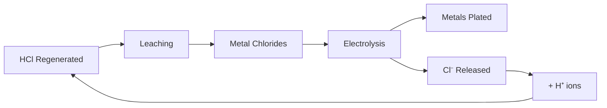

# Acid Regeneration

## The Closed-Loop Process

### Concept
Acid is not consumed - it's **regenerated** through the electrochemical process:

### Process Steps
1. Metals dissolved in HCl → metal chloride solutions
2. Electrolysis of metal chloride solution
3. Metals reduce and plate onto cathode
4. Chloride ions released back to solution
5. H⁺ from water electrolysis regenerates HCl
6. Regenerated acid returns to leaching

### Acid Balance
- Acid consumed in leaching
- Acid regenerated in refining
- Net consumption is minimal
- Continuous recycling possible

## Efficiency Considerations

### Losses
- Solution carryover with waste
- Gas evolution (Cl₂ escaping)
- Side reactions

### Monitoring
- pH measurement
- ORP monitoring
- Metal concentration analysis

### Optimization
- Membrane integrity (prevent cross-contamination)
- Proper electrode spacing
- Current density control
- Temperature management
